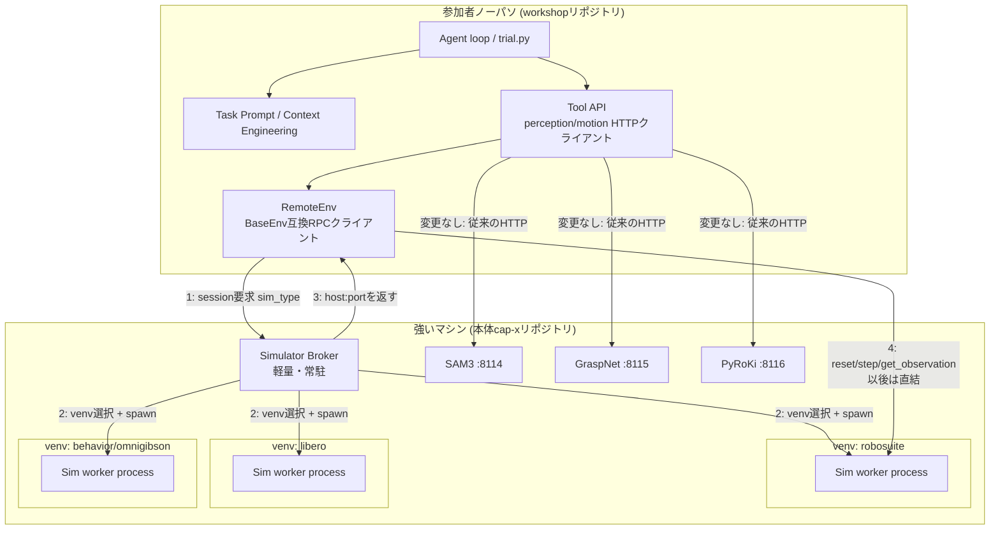

# CaP-X Workshop 大改修プラン（棚卸し + 設計案）

> 位置づけ: ドラフト。レビュー後に確定させる。
> 前提: `CAPX_ARCHITECTURE.md`（本体cap-xの静的調査）を読了済みであることを前提に書いている。

## 0. 要件確認

1. Perception API（SAM3/GraspNet/PyRoKi/OWL-ViT/SAM2/cuRobo/Molmo）は**通信形式を変えない**。本体cap-xと同じエンドポイントを使い回す。
2. Simulator（Robosuite/LIBERO/BEHAVIOR）は**venvが分かれる**制約がある。Simulatorの起動とリクエスト管理を行う**ブローカー**が必要。
3. Agent部分（VLM prompt、trial loop、tool定義）は**クライアント側（参加者ノーパソ）で動かす**ため、現行ソースからうまく切り離す。

ワークショップで参加者にいじらせたいのは次の2点。

- Agentループ・ワークフローの改良（multi-turn判定、regenerate/finish、skill libraryの使い方等）
- Agentに渡すPromptの設計（Context Engineering的なもの）

## 1. 現状棚卸し: 何が「強いマシン側」に残り、何が「クライアント側」に移るか

`capx`の中で、低レベルSimulatorとの結合点は驚くほど狭い。`BaseEnv`は5メソッドの抽象クラスでしかない（`capx/envs/base.py:11-76`）。

```python
class BaseEnv(Env):
    def reset(self, *, seed=None, options=None) -> tuple[ObsType, dict]: ...
    def step(self, action) -> tuple[ObsType, float, bool, bool, dict]: ...
    def get_observation(self) -> ObsType: ...
    def compute_reward(self) -> float: ...
    def task_completed(self) -> bool: ...
```

`CodeExecutionEnvBase`（高レベルAgent環境）はこの5メソッドしか呼ばない（`capx/envs/tasks/base.py:128-298`）。`_build_low_level()`は文字列name→レジストリ解決 or YAML `_target_`→`instantiate()`のどちらかで低レベルenvを得るだけで、Simulatorの実装詳細には触れない（同`L207-225`）。**この5メソッドの境界が、Simulatorをネットワーク越しにできる唯一かつ十分な切断面**である。

一方で、`_exec_user_code()`はVLM生成コードのglobalsに`env`（=低レベルSimulatorオブジェクトそのもの）を直接bindしている（`capx/envs/tasks/base.py:157`, `194`）。つまり生成コードは理論上5メソッド以外のSimulator内部（例: privileged APIが直接触るMuJoCo state）にもアクセスできる。これは後述するリスク①に直結する。

Perception/Motion API（`ApiBase`サブクラス、`capx/integrations/base_api.py:13-121`）は`env.get_observation()`（＝5メソッドの1つ）でRGB/depthを取り、あとはSAM3等の**独立したHTTPサーバ**を叩くだけ（`capx/integrations/vision/sam3.py`等）。Simulatorの内部構造には依存していない。

### 棚卸し表

| 現在の場所 | 役割 | 移動先 | 変更要否 |
|---|---|---|---|
| `capx/envs/base.py` (`BaseEnv`, registry) | 低レベルenv抽象・レジストリ | 本体（強いマシン） | 変更なし |
| `capx/envs/simulators/*.py` | Robosuite/LIBERO/BEHAVIOR実装 | 本体（強いマシン） | 変更なし |
| `capx/serving/launch_*_server.py`, `launch_servers.py` | Perception/Motionサーバ | 本体（強いマシン） | 変更なし（要件1） |
| `capx/integrations/vision/*.py`, `capx/integrations/motion/*.py` | Perception/MotionへのHTTPクライアント | **workshopリポジトリへコピー** | ほぼ無変更（envに依存しない） |
| `capx/integrations/base_api.py`, `capx/integrations/franka|r1pro/control.py`等 | Tool（API）定義 | **workshopリポジトリへコピー** | `env.get_observation()`呼び出しがRemoteEnv経由になるだけ |
| `capx/envs/tasks/base.py` (`CodeExecutionEnvBase`) | Agent実行ループの土台 | **workshopリポジトリへコピー** | ほぼ無変更（5メソッドしか使わない） |
| `capx/envs/tasks/franka/*.py`, `r1pro/*.py` | Task Prompt/oracle code | **workshopリポジトリへコピー** | ここが参加者の改造対象 |
| `capx/envs/trial.py` | 1trial orchestration、multi-turn判定 | **workshopリポジトリへコピー** | ここが参加者の改造対象 |
| `capx/llm/client.py` | VLMへのHTTP問い合わせ | **workshopリポジトリへコピー** | 無変更 |
| `capx/utils/launch_utils.py` (prompt/extract_code部分) | code fence抽出、config merge | **workshopリポジトリへコピー** | 無変更 |
| `capx/skills/` | skill library | **workshopリポジトリへコピー**（任意） | 無変更 |
| `capx/envs/configs/instantiate.py`, `loader.py` | YAML `_target_`解決 | **workshopリポジトリへコピー** | 無変更（依存が軽い） |
| （新規）`RemoteEnv` | 低レベルenvのRPCクライアント | 両方（インターフェース定義はworkshop、本体には対になるサーバ） | 新規作成 |
| （新規）Simulator broker + per-sim RPCサーバ | セッション/venv/GPU管理 | 本体（強いマシン） | 新規作成 |

### venv分離の裏付け

`pyproject.toml`に既に明確な制約がある。

```toml
[tool.uv]
conflicts = [
  [{ extra = "robosuite" }, { extra = "libero" }],   # L145-149: 同一venv不可
  [{ extra = "molmo" }, { extra = "robosuite" }],
  [{ extra = "molmo" }, { extra = "verl" }],
]
[tool.uv.workspace]
exclude = ["capx/third_party/b1k"]   # L177-179: BEHAVIOR/OmniGibsonは既にworkspace外
```

つまり強いマシン側には最低3つのvenvが要る。

- `venv-robosuite`（`uv sync --extra robosuite`）
- `venv-libero`（`uv sync --extra libero --extra contactgraspnet`）
- `venv-behavior`（`capx/third_party/b1k`配下、独自環境。Isaac Sim必須）

これはPerceptionサーバ（sam3, graspnet, pyroki等）とは別軸の制約で、Perception側は`capx/serving/launch_servers.py`の`SERVER_REGISTRY`（L49-92）が1つのvenvから`subprocess.Popen`で一括起動できるのに対し、Simulatorは**起動するvenv自体を切り替える**必要がある点が本質的に異なる。

## 2. 全体アーキテクチャ



ポイント: **Brokerはセッション確立（handshake）だけを担い、実際のstep/reset往復はクライアント↔Sim workerが直結する。** Brokerを常時プロキシに挟むと、`move_to_joints_blocking()`のような高頻度step呼び出し（後述リスク②）がBrokerを二重に経由してレイテンシが増えるため。

## 3. コンポーネント設計

### 3.1 Perception/Motion API — 変更なし

要件1の通り、`capx/serving/launch_*_server.py`、エンドポイント（`/segment`, `/plan`, `/ik`等）、port割り当ては現状維持。workshopリポジトリの`capx/integrations/vision/*.py`, `motion/*.py`はほぼコピーのみで動く。

### 3.2 Simulator Broker（新規、本体リポジトリに追加）

`capx/serving/launch_servers.py`のGPU割り当てロジック（`detect_gpus()`, `allocate_gpus()`, `wait_for_ready()`, L134-464）は**Simulator worker管理にもそのまま転用できる**設計になっている。Brokerはこれを拡張する形で作る。

責務:
- 参加者ごとの session_id を発行
- YAML `low_level`名（例: `franka_robosuite_cubes_low_level`）→ 対応するvenv（robosuite/libero/behavior）を解決するレジストリを持つ（`SERVER_REGISTRY`と同型で `venv_python` フィールドを追加したもの）
- `subprocess.Popen([venv_python, "-m", "capx.serving.launch_sim_server", "--low-level", name, "--port", port])` でSim worker（3.4節）を起動
- GPU割り当て（既存`allocate_gpus()`を流用。BEHAVIOR/Isaac Simは1GPUあたりの同時起動数上限をconfigで持たせる）
- port/session を参加者に返却
- アイドルタイムアウト・切断検知でworker processをreap（GPUメモリ解放）

プロトコル: 新規に軽量なHTTP（FastAPI）で良い。Brokerは常駐だが重い依存を持たない（Perceptionモデルは載せない）ので、専用の軽量venvで動かせる。

### 3.3 RemoteEnv（新規）

`BaseEnv`の5メソッドを実装するRPCクライアント。Brokerからもらった`host:port`に直結し、Sim workerと1:1で通信する。

```python
class RemoteEnv(BaseEnv):
    def __init__(self, broker_host, broker_port, low_level_name, ...):
        # 1. Brokerにsession要求 → (worker_host, worker_port) を取得
        # 2. worker_host:worker_port へ接続
    def reset(self, *, seed=None, options=None): ...  # RPC
    def step(self, action): ...                        # RPC
    def get_observation(self): ...                     # RPC
    def compute_reward(self): ...                       # RPC
    def task_completed(self): ...                       # RPC
```

通信フォーマットは`capx/utils/msgpack_server_client_utils.py`の資産（`send_framed`/`recv_framed`, msgpack-numpyでndarray対応済み, L1-25）をベースに拡張する。現状の`MsgpackNumpyServer`は「最新observation/actionをポーリングする」実機ブリッジ専用の形（L28-59）なので、そのままは使えない。汎用RPC用に、メッセージを `{"method": "step", "args": {...}}` → `{"result": ...}` / `{"error": ...}` の形に薄く拡張する。

### 3.4 Sim worker server（新規、本体リポジトリに追加）

`get_env(name)`で作った実物のSimulator（`BaseEnv`）を1個ラップし、3.3のRPCプロトコルに応答するだけの薄いサーバ。venvごとに存在できる形にする（`capx/envs/simulators/__init__.py`のtry/except構造上、1venvに1 Simulator家族だけがimportできる前提を踏襲）。Broker起動時にvenv切り替えでこのサーバを起動するので、サーバ自体のコードは1つで良い。

## 4. Agentワークショップリポジトリの抽出方針

### 何をコピーするか

`capx/envs/tasks/base.py`（`CodeExecutionEnvBase`）、`capx/envs/trial.py`、`capx/llm/client.py`、`capx/integrations/base_api.py`＋各API実装、`capx/integrations/vision|motion/*`、`capx/utils/launch_utils.py`のprompt/extract_code部分、`capx/envs/configs/instantiate.py|loader.py`、（任意で）`capx/skills/`。

これらはいずれも「重い依存（torch, robosuite, libero, omnigibson, sam3のモデル重み等）」を直接importしない、または軽量な範囲（numpy, PIL, requests, openai SDK程度）で完結する。`pyproject.toml`の`[project.dependencies]`（無条件依存, L19-57）には`torch`や`sam3`が含まれてしまっているため、**完全ゼロ依存にはならない**が、Robosuite/LIBERO/OmniGibson/curobo/contact_graspnet等のGPU実装本体は不要になる。workshopリポジトリの`pyproject.toml`は新規に書き、必要最小限（`numpy`, `requests`/`httpx`, `openai`, `pyyaml`, `omegaconf`, `pillow`, `msgpack_numpy`程度）に絞る。

### 何を書き換えるか

- `capx/envs/tasks/base.py:_build_low_level()`のstring解決パス（`get_env()`）は使わず、YAMLの`low_level`を常に`_target_: ...RemoteEnv`形式に統一する。**コード自体は無改造**（既に`_target_`経由のinstantiateに対応済み、`base.py:217-224`）。
- `capx/envs/tasks/franka/*.py`等のTask Prompt/oracle codeは**そのまま持ってきて教材の初期状態**にする。ここが参加者の改造対象。
- `capx/envs/trial.py`の`_run_single_trial()`/`_handle_multi_turn_step()`も**そのまま持ってきて初期状態**にする。ここも改造対象（要件のAgentループ改良）。

### 何を持ち込まないか

`capx/envs/simulators/*.py`、`capx/envs/base.py`のSimulatorレジストリ部分、third_party配下すべて、`capx/serving/launch_*_server.py`（サーバ実装自体は本体側の資産）、CaP-RL関連（`verl_agent_reward/`, `capx/cli/prepare_verl_dataset.py` — 要件通りそのまま本体に残す）。

## 5. リスク・注意点

**① VLM生成コードが`env`に直接アクセスする問題**
`_exec_globals["env"]`は生成コードに公開される（`tasks/base.py:157,194`）。privileged tier APIやユーザーが書いた実験的コードが5メソッド以外のSimulator内部状態に触ろうとすると、`RemoteEnv`はそれを転送できず失敗する。
→ 対策: ワークショップ用YAMLはprivileged tierを使わず、標準visual/reduced tierのAPIに限定する。README/教材で「`env`への直接アクセスは非対応」と明記する。

**② 高頻度step呼び出しのレイテンシ**
`goto_pose()`→`move_to_joints_blocking()`はIK収束までstepを繰り返す（`capx/integrations/franka/control.py:417-500`, `robosuite_base.py:122-208`）。RemoteEnv越しだと1skillにつき数十〜百回のネットワーク往復になる。
→ 対策: まず素朴に`step()`単位RPCで動かして体感レイテンシを測る（LAN内なら許容範囲の可能性が高い）。問題があれば`move_to_joints_blocking()`相当のループをSim worker側に持たせ、粒度の粗いRPCに変える（フェーズ4以降の最適化として後回しでよい）。

**③ 同時セッション数とGPU容量**
特にBEHAVIOR/Isaac Simは1GPUに同時に載せられるインスタンス数が少ない可能性が高い。Robosuite/LIBEROはMuJoCoなので軽く、CPUでも多重化しやすい。
→ 対策: ワークショップ当日にBEHAVIOR/Isaac Simを使う場合は、事前に強いマシンのGPUメモリと同時参加人数の上限を見積もっておく。Robosuite/LIBEROを中心の教材にすれば当面この制約は緩い。

**④ record_video/artifact保存**
`_save_trial_artifacts()`（`launch_utils.py:376-460`）はtrial worker（＝ワークショップ側）で動く前提で、RGBフレームは既にobservationとして飛んでくるため、この点は**変更不要**。動画/画像はクライアント側のローカルディスクに保存される。

**⑤ 通信プロトコルの選定**
Broker↔RemoteEnvのhandshakeはHTTP(FastAPI)でよいが、RemoteEnv↔Sim workerの高頻度RPCはmsgpack-numpy TCP（既存資産の拡張）にするか、FastAPI+WebSocketで揃えるか要検討。前者は実機ブリッジと同じ資産を再利用でき軽量、後者はPerceptionサーバとプロトコルの見た目を揃えられる。

## 6. フェーズ分け（叩き台）

| Phase | 内容 | 目的 |
|---|---|---|
| 0 | RemoteEnv + Sim worker（Broker無し、単一venv、手動起動）でRobosuite cube stackを1本通す | RPC境界の技術検証 |
| 1 | Broker実装（単一sim_type、session管理のみ） | セッション分離の検証 |
| 2 | 複数venv対応（robosuite/libero/behavior切り替え、GPU割り当て） | 強いマシン側の完成 |
| 3 | Agentコードのworkshopリポジトリへの抽出・移植、既存Benchmarkとの動作パリティ確認 | 「今まで通り動く」ことの確認 |
| 4 | ワークショップ教材化: Agentループ簡略化、Prompt設計しやすいテンプレ化（本題） | 初心者が触れる形に整える |
| 5 | 複数人同時アクセスの負荷試験 | 本番想定の検証 |

## 7. 要判断事項

- Broker↔Sim worker間、RemoteEnv↔Sim worker間のプロトコルはmsgpack-numpy TCP拡張 か FastAPI/WebSocket か
- Phase 4で既存のmulti-turn/visual differencing/skill library/ensembleのうち、どこまで初期教材に残すか（全部残すと初心者には複雑、削ると自由度が下がる）
- workshopリポジトリの依存管理: 完全独立コピー（今回の方針）で確定か、将来的に本体の更新を取り込む仕組み（例えば該当ファイルだけ`git subtree`で追従）を用意するか
