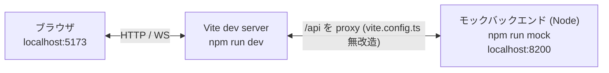

# CaP-X Workshop WebUI ローカル開発用モックバックエンド仕様

> 位置づけ: ドラフト。レビュー後に確定させる。
> 前提: `WORKSHOP_WEBUI_SPEC.md`（特に§2 全体アーキテクチャ、§3.2 Backend、§8 サンドボックス設計）を読了済みであることを前提に書いている。

## 0. 背景と目的

`workshop/webui/`（React + Vite）のフロントエンド修正を、GPUもLinuxもない開発者のローカルマシン（macOS）で進めたい。具体的には「タスクプロンプトの英日切り替え」を皮切りに、複数のフロントエンド修正が控えている。

しかし本物のBackend（`workshop/backend/`）はローカルでは起動できない。理由は3点あり、いずれもフロントエンド側の都合で変えるべきものではない。

1. **セッション用コンテナの起動が`--runtime nvidia`を無条件に要求する**（`workshop/backend/session_manager.py:267-268`）。macOSのDocker Desktopには`nvidia`ランタイムが存在しないため、`POST /api/sessions`は`docker run`の時点で必ず失敗する。これは`WORKSHOP_WEBUI_SPEC.md` §8.2で実機検証のうえ採用した方式であり、ローカル開発のために条件分岐を足すのは本番の隔離設計に手を入れることになる。
2. **Python依存がLinux x86_64限定でロックされている**（`pyproject.toml` `[tool.uv] environments = ["sys_platform == 'linux' and platform_machine == 'x86_64'"]`）。Backend自体はcapxをimportしない薄いプロセスだが（`workshop/README.md` Layout節）、`uv sync`はルートの`pyproject.toml`を使う。
3. **`sam3`が無条件依存かつeditableなサブモジュール参照**（`pyproject.toml` `[tool.uv.sources] sam3 = { path = "capx/third_party/sam3", editable = true }`）。サブモジュール未初期化の状態では`uv sync`が`does not appear to be a Python project`で即失敗する（実機で確認）。

また、仮にBackendが起動できたとしても、Perception API（SAM3/GraspNet/PyRoKi）はLAN内のGPUホスト（`WORKSHOP_ENDPOINT.md`）にしか存在しない。

したがって、**フロントエンドが叩く`/api/*`をNode製のモックサーバーで代替し、本番コードには一切手を入れずにフロントエンド開発を回せるようにする**。

## 1. スコープ

### 1.1 対象

- `workshop/webui/`のフロントエンド開発のみ。リポジトリ直下の`web-ui/`（`capx.web.server`用の別UI）は対象外。
- Backend/Worker/Docker/Perception APIには触れない。`workshop/backend/`配下のファイルは無改造。

### 1.2 やること・やらないこと

| 項目 | 方針 |
|---|---|
| `GET /api/tasks` | 模倣する（`config.py`の`TASKS`と同じID・名前・説明） |
| `POST /api/sessions` | 模倣する（合成フレーム・英語の`task_prompt`・`api_docs`を返す） |
| `GET /api/sessions/{id}/observation` | 模倣する |
| `WS /api/sessions/{id}/stream` | 模倣する（セル実行中に合成フレームを逐次送信） |
| `POST /api/sessions/{id}/cells/run` | 模倣する（疑似実行。成功/失敗/Perception呼び出しの3パターン） |
| `POST /api/sessions/{id}/reset` | 模倣する |
| `POST /api/sessions/{id}/experiments/generate` | 模倣する（固定文面をSSEで分割送信） |
| `POST /api/sessions/{id}/replay` | **模倣しない**。依存なしでmp4は生成できないため`501`を返し、フロントの既存エラー表示（`alert`）に乗せる |
| `DELETE /api/sessions/{id}` | 模倣する |
| ロボットの実動作・Perception・報酬計算 | 模倣しない。フロントのUI状態遷移が通ることだけを目的にする |
| セッションの永続化 | 模倣しない。プロセス内メモリのみ |

### 1.3 本番コードを変えない、という制約

`workshop/webui/vite.config.ts`のdev proxyは`/api`を`http://localhost:8200`へ転送している。モックサーバーは**同じ8200番で待ち受ける**ことで、`vite.config.ts`・`api.ts`・各コンポーネントを1行も変えずに差し替える。「本物のBackendを起動する代わりにモックを起動する」だけの運用にする。

待ち受けアドレスは`127.0.0.1`に限定する（`0.0.0.0`にしない）。認証を持たないサーバーなので、同一LANの他ホストから到達できる状態にはしない。Viteのproxyは同一マシン内からの接続なのでこれで足りる。

## 2. 構成



### 2.1 配置

```
workshop/webui/
├── mock-server/
│   ├── server.js     # HTTPルーティング・WS・SSE・セッション状態
│   ├── fixtures.js   # タスク一覧・task_prompt・api_docs（config.py / capx PROMPT の写し）
│   └── png.js        # 合成カメラ画像のPNGエンコーダ（依存なし）
├── src/              # 無改造。mock-server/ を import しない
└── package.json      # "mock" スクリプトと devDependency "ws" を追加
```

`mock-server/`は`src/`の外に置き、`tsc -b && vite build`の対象にも`src/`からのimport対象にもしない。本番バンドルに混入する経路を構造的に持たせない。

### 2.2 起動手順

```bash
cd workshop/webui
npm install
npm run mock   # ターミナル1: モックバックエンド (localhost:8200)
npm run dev    # ターミナル2: Vite dev server (localhost:5173)
```

### 2.3 依存

- **`ws`をdevDependencyに追加する。** WebSocketのupgradeハンドシェイクとフレーム処理を自前実装すると、モックの本筋と無関係なコードが増えるため。`ws`は本番バンドルには含まれない（`dependencies`ではなく`devDependencies`、かつ`src/`から参照しない）。
- それ以外はNode標準モジュールのみ（`node:http`, `node:zlib`, `node:crypto`）。`express`等は入れない。

## 3. モックであることの明示

「モックとわかるようにする」は要件である。本物と見分けがつかないと、モック相手に確認した挙動を本番の挙動と誤認するリスクがある。以下を全部やる。

| 手段 | 内容 |
|---|---|
| データ | タスク名・説明文・`task_prompt`の先頭に`[MOCK]`を付ける。画面上のどのビューでも一目でわかる |
| 画像 | 合成カメラ画像の上部にマゼンタの帯を描く。本物のRobosuiteレンダリングと絶対に混同しない |
| コンソール | 起動時にバナーを出し、全リクエストを1行ログする |
| HTTPヘッダ | 全レスポンスに`X-Mock-Backend: 1`を付ける（将来フロント側で検出したくなった場合の足がかり。現時点でフロントは参照しない） |
| 配置 | `mock-server/`ディレクトリに隔離し、ファイル冒頭コメントで用途を明記 |

## 4. エンドポイント別の挙動

本物の挙動は`workshop/backend/app.py`と`workshop/backend/env_runtime.py`に基づく。

| エンドポイント | 本物 | モック |
|---|---|---|
| `GET /api/tasks` | `config.py`の`TASKS`を返す（`app.py:97-109`） | `fixtures.js`の同内容（`[MOCK]`付き） |
| `POST /api/sessions` | コンテナ起動→`reset()`→初期フレーム・`task_prompt`・`api_docs`（`app.py:111-139`） | `session_id = "mock-<連番>"`を発行。合成フレーム、`fixtures.js`の英語`task_prompt`、`api_docs`を返す。未知の`task_id`は`404` |
| `GET .../observation` | 直近の観測（`app.py:141-144`） | 直近の合成フレーム |
| `WS .../stream` | Workerの`/stream`を中継。`{"camera", "image"}`のJSONテキスト（`app.py:146-194`, `worker_server.py:106`） | セル実行中のみ、約6fpsで合成フレームを送る。未知の`session_id`は`4004`でclose（本物と同じコード） |
| `POST .../cells/run` | `env.step(code)`（`env_runtime.py:109`） | §4.1 |
| `POST .../reset` | `env.reset()`→フレーム・`task_prompt`・`api_docs`（`env_runtime.py:95-107`） | ステップカウンタを0に戻し、初期フレームを返す |
| `POST .../experiments/generate` | LLMをSSE中継。`delta`→`done`（`app.py:210-262`） | 固定の応答文を数十文字ずつ`delta`で流し、pythonのコードフェンスから抽出した`code`を`done`で返す |
| `POST .../replay` | mp4の`FileResponse`（`app.py:269-276`） | `501` + `[MOCK] replay is not supported` |
| `DELETE .../{id}` | コンテナ破棄。既知・未知を問わず`200` `{"status":"closed"}`（`app.py:278-282`） | 同じ。未知IDでも`200` |

本物は`SessionManager`がセッション単位の`asyncio.Lock`で各操作を直列化している（`session_manager.py:121,371-391`）ため、モックもセッションごとのPromiseチェーンで`observation`/`cells/run`/`reset`/`DELETE`を直列化する。実行中のセルがある間にリセットを押しても、本物と同じくリセットは実行完了を待つ。

リクエストボディの検証はFastAPI/Pydanticの挙動（`app.py:38-54`のモデル）に合わせ、JSON構文エラー・必須フィールド欠落・型不一致は`422`で拒否する。フロントのリクエスト形式の退行がモック相手でも検出できるようにするため。

### 4.1 `cells/run`の疑似実行

本物は`exec()`でコードを実際に走らせるが、モックはコードの**文字列内容だけ**を見て3パターンに分岐する。フロントのUI状態（実行中スピナー、stdout/stderr表示、エラー表示、Perceptionパネル、リプレイ）を一通り通せることが目的。

| コードの内容 | 結果 |
|---|---|
| 通常 | 約1.5秒待つ（この間に`/stream`へフレームを流す）。`ok: true`、`stdout`に`[MOCK]`付きの実行サマリ |
| `raise`または`error`という文字列を含む | `ok: false`、`stderr`にトレースバック風の文字列。エラー表示UIの確認用 |
| `get_object_pose`または`sample_grasp_pose`を含む | 上記に加え`perception_steps`を1件返す（`tool_name`, `text`, `images`, `highlight`）。`images`には§5の合成PNGをそのまま入れる。Perceptionパネルの確認用 |

`reward`は`0.0`、`terminated`/`truncated`は`false`、`task_completed`は`null`で固定する。フロント側でこれらを使った分岐を追加したくなった時点でfixtureを拡張する（YAGNI）。

### 4.2 `task_prompt`と`api_docs`のfixture

- `task_prompt`は`capx/envs/tasks/franka/*.py`の`PROMPT`定数（例: `franka_lift.py:3-8`）を**英語のまま**写す。これが後続の英日切り替え作業の対象であり、モック上で本番と同じ文面を見られることに意味がある。
- `task_prompt_ja`は`config.py`の`prompt_ja`の写し（`WORKSHOP_WEBUI_PROMPT_LANG.md`）。本物と同じく`null`なら「日本語なし」を意味する。
- `api_docs`は`ApiBase.combined_doc()`（`capx/integrations/base_api.py:96-121`）の書式（`name(signature)` / `  Doc:` / 4スペースインデントの本文）で、visual tierの主要5関数（`get_object_pose`, `sample_grasp_pose`, `goto_pose`, `open_gripper`, `close_gripper`）分を手書きする。`ApiDocsModal`のMonaco表示を確認できればよく、全関数を網羅しない。**全タスクで同じ内容を返す**（本物はタスクのAPI tierごとに異なり、例えば`two_arm_handover`は`goto_pose_arm0/1`等を公開する — §6）。
- これらは`config.py`・capx本体からの**手動コピー**であり、自動同期しない。本体が変わってもモックは追従しない前提（§6）。

## 5. 合成カメラ画像

依存なしでPNGを生成する。`node:zlib`の`deflateSync`でIDATを作り、CRC32だけ自前実装する（`png.js`、数十行）。

- サイズ: 320×240、RGB
- 内容: 暗い背景 + 赤い正方形（「キューブ」）。ステップカウンタに応じて正方形を移動させ、フレームごとにbase64が異なるようにする。`App.tsx`の`/stream`ハンドラは直前フレームと同一なら捨てる（`prev.image !== data.image`）ため、動きのない画像ではリプレイが1フレームにしかならない
- 上部にマゼンタの帯（§3）
- カメラ名はタスクの`save_camera_name`（`fixtures.js`の`PRIMARY_CAMERA`。`robosuite_base.py:53`のデフォルト`robot0_robotview`、`nut_assembly`は`birdview`、`two_arm_handover`は`agentview`）と`wrist`（`env_runtime.py:56`）の2つ。`/stream`に流すのは前者のみ（§8.1）

`PerceptionPanel.tsx:25`は`data:image/jpeg;base64,`を前提にしているが、ブラウザは画像バイト列の先頭でフォーマットを判定するため、PNGのバイト列を渡しても表示される見込み。実装後に確認して結果を§8に追記する。

## 6. 制約・注意点

- **忠実度は「UI状態遷移が通る」レベル。** ロボットが実際にどう動くか、Perceptionが何を返すか、報酬がどう付くかは一切再現しない。本番の挙動確認は引き続き強いマシンで行う。
- **所要時間も再現しない。** 本物はセッション作成時のモデルロードやセル実行に数秒〜数十秒かかるが（`App.tsx:530`の案内文）、モックは固定で約1.5秒。長時間待ちのUXは検証対象外と割り切る。
- **ポート8200を本物と共用する。** 本番マシンで誤ってモックを起動すると本物と衝突する（`EADDRINUSE`で起動失敗するので実害は出ないが、逆にモック起動中に本物を起動しようとしても失敗する）。§3の明示手段で気づける前提。
- **fixtureは手動コピー。** `config.py`の`TASKS`やcapxの`PROMPT`が変わってもモックは追従しない。乖離に気づいたら手で直す。
- **`api_docs`はタスクを区別しない。** 本物はタスクのAPI tierに応じた`combined_doc()`を返す（双腕は`goto_pose_arm0/1`、`open_gripper_arm0/1`等）が、モックは単腕visual tierの抜粋を全タスクに返す。モックのAPIドキュメントを見てロボット制御コードを書く用途は想定していない（フロントの表示確認用）。タスク別に必要になった時点でfixtureを増やす。
- `replay`は動かない。リプレイ動画の保存ボタンを押すと`alert`が出る。クライアント側の自動リプレイ（`WORKSHOP_WEBUI_REPLAY.md`）は`/stream`経由なので動く。

## 7. 要判断事項

- `ws`をdevDependencyに追加してよいか。代替はupgradeハンドシェイクの自前実装（追加依存ゼロだが、モックの本筋と無関係なコードが数十行増える）
- `replay`を`501`にするか、ダミーのバイナリを返して「ダウンロードは成功するが再生できないファイル」にするか。前者の方が「動いていない」ことが明確
- fixtureを`config.py`から自動生成する仕組みを作るか。現時点では手動コピーで十分と判断（タスクは6件、変更頻度も低い）

## 8. 追記・実装確定

§7の判断はすべて第一案で確定した（`ws@8.21.3`をdevDependencyに追加、`replay`は`501`、fixtureは手動コピー）。実装後にわかったこと・計画から変えたことを以下に残す。

### 8.1 ストリームは1カメラだけ流す（計画からの変更）

§5では`robot0_robotview`と`wrist`の2カメラを生成するとしていたが、`/stream`に**両方を流すと、クライアント側リプレイで2カメラのフレームが交互に混ざる**ことがブラウザ確認で判明した。`App.tsx`の`/stream`ハンドラは受信した全フレームをカメラ名を区別せず`activeRunFramesRef`に積むためで、本物のWorkerが1カメラしか流さない（`env_runtime.py:160-166`の`save_camera_name`）以上、フロント側にカメラを分ける必要がなかった。モックも`robot0_robotview`のみを流すよう修正した（`server.js`の`STREAM_CAMERA`）。`frames`（セッション作成・`observation`・`cells/run`・`reset`のレスポンス）には引き続き2カメラ分を入れる。

### 8.2 PerceptionパネルはPNGでも表示できる（§5の未確認事項の決着）

`PerceptionPanel.tsx:25`の`data:image/jpeg;base64,`にPNGのバイト列を渡しても、Chromiumは問題なく描画した。fixtureの`images`にはカメラと同じ合成PNGをそのまま入れている。

### 8.3 確認済みの範囲

curl/Node（全エンドポイント）とPlaywright（Chromium）で以下を通した。

- タスク一覧に`[MOCK]`付きの6タスクが表示される。未知の`task_id`は`404`
- 手動モード: セッション開始→英語`task_prompt`バナー→セル実行（約1.5秒、実行中に`/stream`へ10フレーム）→`stdout`表示→自動リプレイ→Perceptionパネルに画像付きステップ
- `raise`/`error`を含むセルは`ok: false`＋トレースバック風`stderr`
- プロンプトモード: SSEで文面がストリーミング→pythonのコードフェンスからコード抽出→「リセット&Run」で実行
- APIドキュメントモーダル（Monaco read-only）に`combined_doc()`書式のfixtureが表示される
- `replay`は`501`、未知セッションへのWebSocketは`4004`でclose、`DELETE`は既知・未知を問わず`200`、削除後の`observation`は`404`

### 8.4 コードレビュー（Codex）で直した点

実装後にCodex CLIでレビューし、本番との契約差として以下を修正した。いずれも本番コード（`app.py`, `session_manager.py`, `capx/envs/simulators/*`）を当たって根拠を確認したうえで反映している。

- セッション操作の直列化（§4に追記）。本物の`asyncio.Lock`に相当するPromiseチェーンを持たせた
- カメラ名のタスク別化（§5に反映）。`nut_assembly`と`two_arm_handover`は`robot0_robotview`ではない
- リクエスト検証の`422`化（§4に追記）
- `DELETE`を本物と同じ「常に`200` `{"status":"closed"}`」に
- WebSocketの`error`イベント処理と、送信前の`readyState`確認
- `workshop/README.md`からこのドキュメントへの相対パス

`api_docs`のタスク別化も指摘されたが、モックの目的（フロント表示の確認）には不要と判断し、§6に制約として明記するにとどめた。

### 8.5 Monacoエディタへの自動入力について（開発時のメモ）

Playwright等でMonacoのセルにコードを入れる場合、`textarea`への`fill`は効かない（`readonly`かつ`aria-hidden`）。`window.monaco.editor.getModels()`から該当モデルを取り`setValue()`するのが確実だった。
