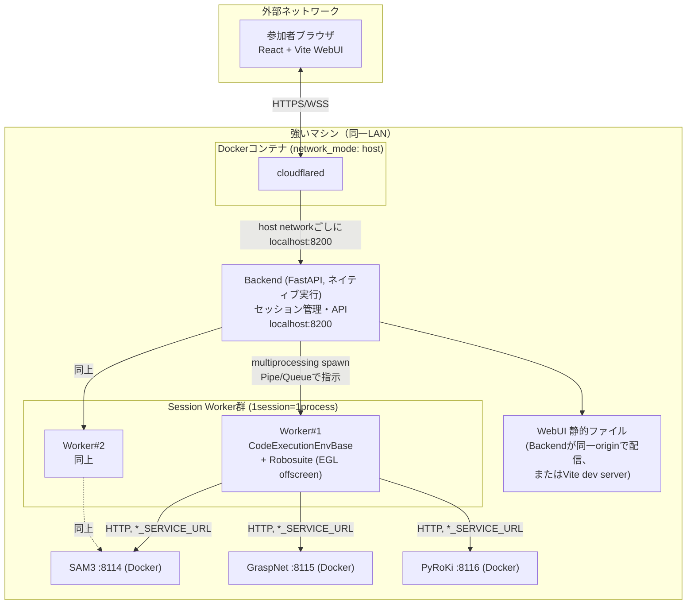

# CaP-X Workshop WebUI仕様書（Robosuite遠隔実行編）

> 位置づけ: ドラフト。レビュー後に確定させる。
> 前提: `WORKSHOP_REFACTOR_PLAN.md`（Agentワークショップ大改修プラン）と`CAPX_ARCHITECTURE.md`を読了済みであることを前提に書いている。

## 0. 要件変更のサマリ

`WORKSHOP_REFACTOR_PLAN.md`はAgentループ改良・Prompt設計を参加者に触らせる前提（LLMがコードを生成し、複数Simulator=Robosuite/LIBERO/BEHAVIORをvenv分離しつつ遠隔ホストする）で書かれていた。今回の要件は以下の点でスコープが変わる。

| 項目 | 旧プラン | 今回の要件 |
|---|---|---|
| コード生成主体 | LLM（VLM Agent） | **参加者が手書き**（LLM不使用） |
| 対象Simulator | Robosuite / LIBERO / BEHAVIOR | **Robosuiteのみ** |
| 参加者が触る場所 | 手元PC上のAgentループ・Prompt | **新規WebUI**（ブラウザ）経由でコードを書く |
| Perception API | 高レベル/低レベル両方（VLM用） | **高レベルAPI**（segment等）中心 |
| 成果物のドキュメントスコープ | Agentワークフロー全般 | **WebUI開発 + Robosuite遠隔実行**に限定 |

この変更により、旧プランの核心課題だった「venv分離を跨ぐRemoteEnv/RPC/Broker」は**不要になる**（§5で詳述）。かわりに新規の論点は「ブラウザからコードを書いて実行し、映像で結果を見る」ためのWebUI/Backend設計と、それを外部公開するインフラ設計になる。

## 1. スコープ確定

### 1.1 対象タスク：選択式レジストリとして設計

具体的にどのRobosuiteタスクを当日デモに使うかは主催者側で後から決定する。そのため本仕様では特定のタスクを固定するのではなく、**タスクを追加・選択できる仕組み**を定義する。

- Backend側に「タスクレジストリ」（タスクID、表示名、説明文、対応する`env_configs/*.yaml`パス、サムネイル画像のマッピング）を持たせる。実体は小さなYAML/JSON1枚で良い。
- `capx/envs/simulators/`配下には`robosuite_cube_lift.py`（cube lifting）、`robosuite_cubes.py`/`robosuite_cubes_restack.py`（cube stack/restack）、`robosuite_nut_assembly.py`（nut assembly）、`robosuite_spill_wipe.py`、`robosuite_two_arm_lift.py`/`robosuite_handover.py`（双腕）など、既にRobosuiteタスクの実装が複数存在する。レジストリに1エントリ追加するだけでWebUIから選択可能になるようにする。
- WebUIのタスク選択画面はレジストリの内容をそのままカード一覧として描画するだけにし、タスクの追加・削除・入れ替えはコードを触らずYAML/JSONの編集だけで完結させる。

### 1.2 Perception APIの層（tier）— 全タスク共通

「タスクによってAPIの数は変えず、使えるAPIは常に同じ」という要件のため、tierは全タスク共通で1つに固定する。

`capx/integrations/base_api.py`の`ApiBase`はYAML差し替えで複数の"tier"（実体は別クラス）を切り替えられる。

- **visual tier**（`capx/integrations/franka/control.py`）: `get_object_pose`, `sample_grasp_pose(object_name)`, `goto_pose(pos, quat, ...)`, `open_gripper`/`close_gripper` など。Perception→Grasp計画→IKまで内部で完結する「完成品」API。
- **reduced tier**（`capx/integrations/franka/control_reduced.py`）: `segment_sam3_text_prompt(rgb, text_prompt)` / `segment_sam3_point_prompt(rgb, point_coords)` がmask/box/scoreの生データを返すのみで、そこから物体位置を計算し、IK/joint-move系の個別プリミティブを組み合わせるのは呼び出し側の責務。

**reduced tierを全タスク共通の標準として採用する**ことを推奨する。理由は2点。

1. 要件の「Perception APIの生出力に触れて泥臭さを体感する」という目的に最も合致する。
2. §1.4で述べる通り、`segment_sam3_text_prompt`/`segment_sam3_point_prompt`は呼び出し時に**segmentation overlay画像を既にログしている**ため、要件で追加された「SAM3のセグメンテーション結果をオプションで見られるようにしたい」がそのまま実現できる（visual tierは内部でSAM3を呼ぶがユーザーコードからは呼び出しが見えないため、この可視化との相性が悪い）。

タスクによって物体数・工程数は異なるが、使用可能なAPI関数の一覧は常に同じにする。

> **更新（実装後の決定）**: 実際のデモではreduced tierではなく**visual tierを全タスク共通の標準として採用**することにした（`workshop/backend/config.py`の`TASKS`は`franka_robosuite_*.yaml`＝visual tier用の無印YAMLを指す）。理由: デモでは高レベル関数（`get_object_pose`, `sample_grasp_pose`）で「動かしてみる」体験を優先する。なお上記の懸念②は実装後の調査で誤りと判明した — `capx/integrations/franka/control.py`の`get_object_pose`/`sample_grasp_pose`も内部のSAM3呼び出し・GraspNet呼び出しのたびに`_log_step`/`_log_step_update`でexecution_loggerに記録しており（`control.py:154-406`）、visual tierでも§1.4のPerceptionビューは無改造でそのまま機能する。reduced tierへ切り替えたい場合は`config.py`の`config_path`を`*_reduced_api.yaml`に戻すだけでよい。

### 1.3 実行モデル：コードブロック＝1 `step()`呼び出し

`capx/envs/tasks/base.py`の`CodeExecutionEnvBase`は、`BaseEnv`の`step(action)`の`action`に**Pythonコード文字列**を渡す設計になっている（`trial.py`では`obs, reward, terminated, truncated, info = env.step(code)`という呼び方をしている）。実行本体の`_exec_user_code()`は`obs`/`env`/`APIS`を**永続化されたglobals辞書**にbindし、`exec(code, globals, globals)`する。つまり:

- 1回の`env.step(code_block)`呼び出し = Colab/Jupyterの**セル1個の実行**にそのまま対応する。
- globalsが永続化されているため、セルをまたいで変数（把持位置、計算した回転行列など）を持ち越せる＝Colabのセマンティクスと完全に一致する。

これはWebUIの「コードブロックごとに実行できる」という要件と実装がほぼ1:1で対応することを意味し、Backend側で新しい実行モデルを発明する必要がない、という重要な設計上の発見である。

### 1.4 Perception結果（SAM3セグメンテーション）のオプション表示 — 実装可能性の確認

実装可能。既に必要なログ機構が存在する。

`capx/integrations/franka/control_reduced.py`を確認したところ、`segment_sam3_point_prompt`（`:261-268`）と`segment_sam3_text_prompt`（`:299-307`）は呼び出しのたびに以下を行っている。

```python
self._log_step("SAM3 Text Segmentation", f"Running SAM3 text-prompt: '{text_prompt}' …", images=rgb)
...
vis = overlay_segmentation_masks(rgb, masks)   # マスクをRGBに重畳描画
self._log_step_update(text=f"Returned {len(results)} mask(s), best score: {best_score:.3f}", images=vis)
```

つまり「元画像」と「マスクを重畳した画像」の両方が`execution_logger`（`_log_step`/`_log_step_update`、`capx/utils/execution_logger.py`）に自動記録される。同様のログはOWL-ViT検出（`:183-189`）、SAM2（`:222-229`）、Molmo（`:330-338`）、GraspNet（`:414-435`）、IK/move/gripper系（`:468-532`）にも一貫して入っている。

したがってBackend/Worker側の追加実装は不要で、**WebUIの右ペイン「Perceptionビュー」をトグルでON/OFFできるようにし、ONのときだけ`get_execution_steps_with_images()`由来のstepカードを表示する**だけで要件を満たせる。デフォルトOFFにしておけば、参加者は普段は自分のコードとカメラ映像に集中し、「SAM3って何が起きてるの？」と思ったときだけ開いてマスク重畳画像を確認できる、という体験になる。

## 2. 全体アーキテクチャ



ポイント:

- **Perception APIサーバは外部公開しない。** Backend（＝Session Worker）からのみLAN内でHTTPアクセスする。これは現行の`*_SERVICE_URL`環境変数解決（`.envrc.example`、`launch_servers.py`の`resolve_endpoint()`）をそのまま流用でき、変更不要。
- **外部公開するのはWebUI＋Backendの1系統のみ**（単一originにまとめる）。**cloudflaredのみDockerコンテナ化し、`network_mode: host`で起動する。** Backend/WebUIはコンテナ化せず、強いマシン上でネイティブプロセスとして動かす（要件通り）。host networkにすることで、cloudflaredコンテナから追加のポートマッピングなしに`localhost:8200`（Backend）へ到達できる。
- 参考: 既存`capx/web/server.py`は「本番は`web-ui/dist`を単一originで配信し、`useWebSocket.ts`が`window.location`からws/wssとhostを導出する」という構成を取っており、これは**Cloudflare Tunnel越しでも変更なく動く**実績パターンである。ただし今回はworkshop用に切り出した独立リポジトリなので、このファイルを直接引き継ぐ必要はなく、同じ考え方（単一origin・`window.location`ベースのURL解決）だけを踏まえて新規に実装してよい。
- Robosuiteセッション自体はvenvを切り替える必要がない（対象をRobosuite単体に絞ったため）ので、旧プランのBrokerに相当する「重いプロセス管理層」は不要。Backendが直接プロセスを起動・管理する。

## 3. コンポーネント設計

### 3.1 Frontend（React + Vite）

画面は大きく2つ。

**タスク選択画面**
- §1.1のタスクレジストリをそのままカード一覧として描画（タスク名・説明文・サムネイル画像）。表示件数はレジストリのエントリ数に追従するので、後からタスクを増減しても画面の実装は変わらない
- 選択すると`POST /api/sessions`が呼ばれ、Backendが該当タスクのWorkerプロセスを起動し`env.reset()`する

**メイン操作画面**（3ペイン構成）
- 左: カメラビュー。`robot0_robotview`（俯瞰）と`robot0_eye_in_hand`（手先）をタブ切り替え。セッション初期化直後の初期フレームをまず表示し、以降はセル実行のたびに最新フレームへ更新
- 中央: コードエディタ。Monaco Editor（`@monaco-editor/react`、VS Codeと同じエディタコンポーネント）をセル単位で複数配置するColab/Jupyter風UI。各セルに「▶ Run」ボタン、直下にstdout/stderr/例外・reward・task_completedバッジを表示。「+ セル追加」「Run All」も用意
- 右: **Perceptionビュー**（§1.4）。デフォルトは非表示で、トグルONにするとそのセル実行中に呼ばれたPerception API呼び出しのログ（元画像／SAM3等のマスク重畳画像／スコア）をタイムラインで表示する
- 上部ツールバー: タスク名表示、「環境リセット」「リプレイ動画を保存」ボタン、セッション終了ボタン

状態管理はセル配列・実行結果程度の規模なので、Redux等は不要でReactの`useState`/`useReducer`で十分。

### 3.2 Backend（FastAPI）

ワークショップ用に切り出した独立リポジトリなので、既存`capx/web/server.py`を土台にする制約は設けない。単一FastAPIアプリ・REST＋WebSocketというシンプルな構成で新規に綺麗に実装する（§2で触れた「単一origin配信」「`window.location`ベースのURL解決」という考え方だけ踏まえる）。

| エンドポイント | 役割 |
|---|---|
| `GET /api/tasks` | タスクレジストリ（§1.1）の一覧（タスクID・名前・説明・YAMLパス・サムネイル）を返す |
| `POST /api/sessions` | `{task_id}`を受け、Session Workerプロセスを起動し`env.reset()`。`session_id`と初期カメラフレームを返す |
| `GET /api/sessions/{id}/observation` | 直近の観測（カメラフレーム）を返す |
| `POST /api/sessions/{id}/cells/run` | `{code}`を受け、Worker内で`env.step(code)`を実行。`{stdout, stderr, error, reward, terminated, task_completed, frames, perception_steps}`を返す |
| `POST /api/sessions/{id}/reset` | `env.reset()`をやり直す（セル実行結果はフロント側でクリア） |
| `POST /api/sessions/{id}/replay` | 録画済みフレームからmp4を生成し、ダウンロードURL（または直接`FileResponse`）を返す |
| `DELETE /api/sessions/{id}` | Workerプロセスを終了しリソース解放 |

セッション管理はBackendプロセス内の`dict[session_id -> WorkerHandle]`で保持し、アイドルタイムアウトでreapする。同時セッション数の上限は、`capx/serving/launch_servers.py`の`detect_gpus()`/`allocate_gpus()`（GPU検出とビンパッキング割当）と同型のロジックを転用し、EGLオフスクリーンレンダリングに使うGPUメモリから決める。

### 3.3 Session Worker

- **1セッション = 1 OSプロセス**。`capx/utils/parallel_eval.py`の並列評価が採用している`multiprocessing.get_context("spawn")`（CUDA + MuJoCo/EGLの組み合わせに対する互換性のため明示的にspawnを使う設計）をそのまま踏襲する。MuJoCo/EGLコンテキストはスレッドセーフではないため、プロセス分離は必須。
- Workerプロセスは起動時に`CodeExecutionEnvBase`（タスクYAMLから`_target_`解決）のインスタンスを1つ保持し、`env.reset()`→（セル実行のたびに）`env.step(code)`→必要なら`env.get_video_frames()`を呼ぶだけ。**新規に実行エンジンを書く必要はない。**
- Backend↔Worker間の通信は、同一マシン内・同一Python実行系内なので`multiprocessing.Queue`（またはPipe）で十分。numpy配列はpickleでそのまま送受信できるため、旧プランで検討していた「msgpack-numpy TCP RPC」「RemoteEnv」は**今回の構成には不要**（§5）。

### 3.4 Perception結果表示（トグル式Perceptionビュー）

§1.4で確認した通り、`capx/utils/execution_logger.py`の`log_step`/`log_step_update`が各Perception API呼び出しの元画像・マスク重畳画像等を既に記録しているため、`cells/run`のレスポンスに「そのセル実行中に新規追加されたstep」の差分（`get_execution_steps_with_images()`相当）を含めるだけでよい。新規にPerception可視化パイプラインを作る必要はなく、フロント側はこれをトグル表示のPerceptionビュー（3.1節）に流し込むだけ。

### 3.5 リプレイ動画

`trial.py`の`_run_single_trial`は`env.enable_video_capture(True, clear=True, wrist_camera=...)`でフレーム記録を有効化し、`env.get_video_frames(clear=True)`＋`capx/utils/video_utils.py`の`_write_video`でmp4を生成する仕組みを既に持つ。セッション開始時に`enable_video_capture(True)`しておき、「リプレイ動画を保存」ボタン押下時にこの仕組みを呼んで`FileResponse`でブラウザにダウンロードさせる。

## 4. インフラ設計

- **強いマシン1台**（同一LAN）に以下を同居させる。
  - Perception APIサーバ群（`docker/docker-compose.yml`、既存のsam3:8114 / graspnet:8115 / pyroki:8116コンテナをそのまま利用）
  - Backend（FastAPI）とSession Workerプロセス群 — **Dockerコンテナ化しない**。マシンに直接インストールしたRobosuite用venvからネイティブに起動する（`systemd`サービス化 or プロセスマネージャで常駐化）
  - cloudflared — **Dockerコンテナとして起動する**
- Backend→Perception APIは`.envrc.example`の`*_SERVICE_URL`（`SAM3_SERVICE_URL`等）解決をそのまま使う。既存の「Perceptionサーバが別ノードでも`*_SERVICE_URL`を向ければ動く」という設計（README「Perception API / PyRoKi / OpenAI 互換 API のセットアップ」節）がそのまま今回のBackend/Worker側にも当てはまる。
- **外部公開はCloudflare Tunnelで、WebUI＋Backendの1系統のみ。** Perception APIサーバはトンネルに乗せず、LAN内に閉じる（要件通り）。

### 4.1 cloudflared のDocker構成

cloudflaredのみをDockerコンテナ化し、`network_mode: host`で起動する。Backend/WebUIはコンテナ化せずホスト上のプロセスとして動くため、host networkにすることでコンテナから`localhost:<port>`へポートマッピングなしに到達できるようにする（bridgeネットワークのままだとBackendのポートを別途publish/エイリアス解決する手間が生じるため、host networkの方がシンプル）。

```yaml
# docker/docker-compose.tunnel.yml（既存のPerception API用compose files.yamlとは別ファイルとして新設）
services:
  cloudflared:
    image: cloudflare/cloudflared:latest
    network_mode: host
    restart: unless-stopped
    command: tunnel run
    environment:
      - TUNNEL_TOKEN=${CLOUDFLARE_TUNNEL_TOKEN}
```

```yaml
# cloudflared側 config.yml（Tunnel Token方式でなくconfig.ymlベースで運用する場合）
ingress:
  - hostname: workshop.example.com
    service: http://localhost:8200   # Backend（WebUI静的ファイルも同一originで配信）
  - service: http_status:404
```

- Backendは単一origin（`http://localhost:8200`）でWebUIの静的ビルド成果物とAPI/WebSocketの両方を配信する構成にし、ingressルールを1本に保つ（複数ホスト名/複数サービスに分けない）。
- フロントの`window.location`ベースws/wss解決パターンを採用すれば、トンネル越しでもコード変更なしでWebSocketが機能する。
- ワークショップという性質上、Tunnelに認証（Cloudflare Access、もしくは簡易的な共有トークン/Basic認証）を掛けることを推奨する（§7）。

## 5. 旧プラン（`WORKSHOP_REFACTOR_PLAN.md`）からの簡略化ポイント

旧プランはRobosuite/LIBERO/BEHAVIORの3 Simulatorをvenv分離しつつ遠隔ホストする前提だったため、「Broker（venv選択・起動管理）」「RemoteEnv（`BaseEnv`互換RPCクライアント）」「msgpack-numpy TCPの汎用RPC拡張」という3層の新規コンポーネントが必要だった。

今回はスコープをRobosuiteのみに絞ったことで、この3層はまるごと不要になる。

- venvが1つで済む（Robosuite用venvのみ）→ Broker最大の存在理由（venv切り替え）が消える
- クライアント（Agent）が参加者ノーパソで動く前提が消え、「WebUI→Backend→Worker」がすべて同一マシン内で完結する→ネットワーク越しの`BaseEnv` RPC（RemoteEnv）が不要になり、`CodeExecutionEnvBase`をWorkerプロセス内でそのまま直接使える
- 残る唯一のネットワーク境界は「ブラウザ↔Backend」（Cloudflare Tunnel経由）のみで、これは通常のWeb API設計（REST+WebSocket）で済む

一方、旧プランの棚卸し内容のうち以下は今回もそのまま使える。

- Perception/Motion APIのエンドポイント・通信形式は変更なし（`capx/integrations/vision|motion/*.py`）
- `capx/envs/tasks/base.py`（`CodeExecutionEnvBase`）・`capx/envs/trial.py`の動画保存ロジックは無改造で流用
- `capx/serving/launch_servers.py`のGPU割当ロジックは、Simulator worker管理に転用可能という指摘は今回も有効

## 6. フェーズ分け（叩き台）

| Phase | 内容 | 目的 |
|---|---|---|
| 0 | Backend無し・単一プロセスで`CodeExecutionEnvBase`をローカルCLIから叩き、cube liftingをreduced tierで1本通す。`robosuite_cube_lift.py`の`has_renderer=True`設定（非privilegedブランチ）がヘッドレスサーバでクラッシュしないか確認・必要なら`False`に修正 | 実行モデルの技術検証 |
| 1 | Backend（FastAPI）とWorkerプロセス管理（spawn、1セッション1プロセス）、タスクレジストリを実装。REST APIのみでcube liftingを最初から最後まで動かす | セッション分離・タスク選択の検証 |
| 2 | Frontend（Monacoセルエディタ、カメラビュー、タスク選択画面、コントロールバー）を実装し、Backendと結線 | WebUI MVP |
| 3 | Perceptionビュー（トグル表示、`execution_logger`連携）、リプレイ動画保存を実装 | 要件を満たすUIの完成 |
| 4 | タスクレジストリに2つ目以降のRobosuiteタスクを追加し、複数タスクから選べる状態にする（実際にどのタスクをデモで使うかは主催者側で選定） | 教材ラインナップの拡充 |
| 5 | cloudflaredのDocker化・host network設定・config.yml整備 | 外部公開の準備 |
| 6 | Cloudflare Tunnel経由での外部公開テスト、複数セッション同時接続の負荷試験 | 本番想定の検証 |

## 7. 要判断事項・リスク

- **どのタスクを当日使うか**: タスクレジストリの仕組み自体は本仕様で決まるが、実際に選定するタスク（cube系/nut_assembly/spill_wipe/双腕系等）は主催者側で決定する
- **同時セッション数の上限**: EGLオフスクリーンレンダリングをGPU何枚・何セッション/GPUまで載せられるか、ワークショップ当日の参加人数を見積もった上で事前に負荷試験が必要
- **Cloudflare Tunnelの認証方式**: Cloudflare Access、共有トークン、Basic認証のいずれにするか。ワークショップ限定の一時公開なので、運用コストとのバランスで決める
- **cloudflaredのTunnel接続方式**: Tunnel Token方式（ダッシュボードで発行、`TUNNEL_TOKEN`環境変数のみで起動）か、`config.yml`＋認証情報ファイルをコンテナにマウントするlegacy方式か
- **セル実行中の中間フレーム配信**: `move_to_joints_blocking()`等はstep()を多数回内部で繰り返す。セル実行完了後の最終フレームのみ返す（実装コスト低）か、WebSocketで中間フレームも逐次ストリーミングする（体験は良いがレイテンシ/実装コスト増）かはPhase 3以降の判断
- **リプレイ動画の保存先**: ブラウザへの直接ダウンロードのみで良いか、Backend側にも保管して後日参加者に配布できるようにするか
